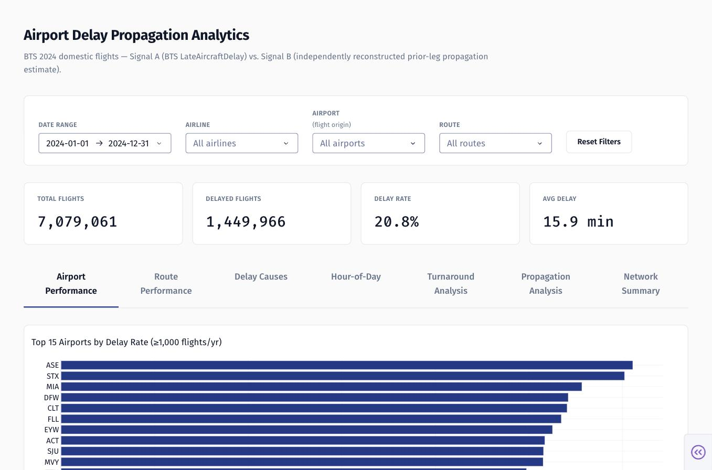
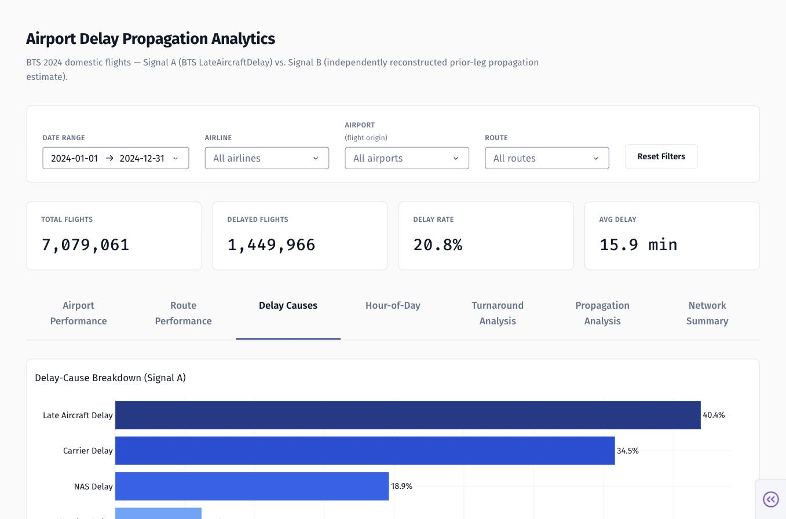
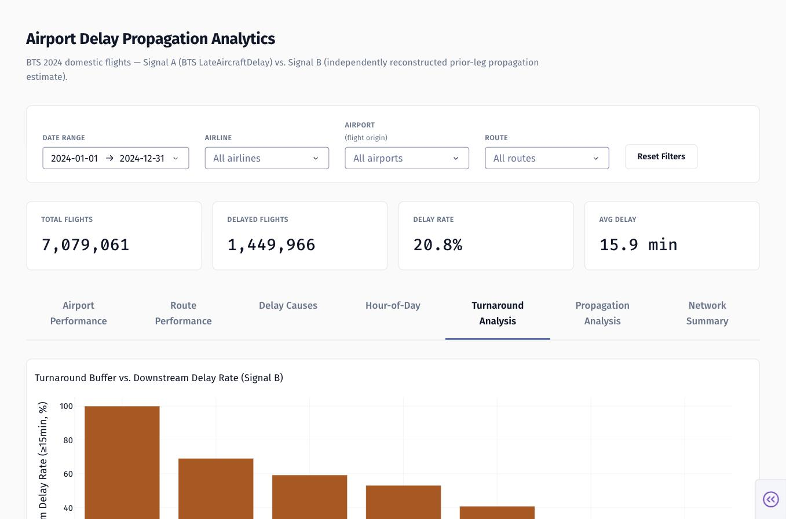
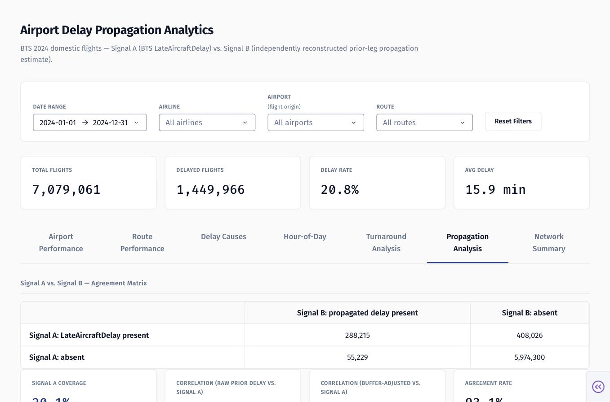

# Airport Delay Propagation Analytics

A data analytics project that measures how flight delays propagate through the
U.S. domestic air network — using real 2024 BTS flight data, PostgreSQL, and an
independently reconstructed aircraft-rotation signal that is cross-validated
against the BTS's own delay-cause attribution.

## The problem

When a flight is delayed, the disruption doesn't necessarily stop at that
flight. If the same aircraft is scheduled to fly again shortly after, its next
departure can inherit the delay — a chain reaction airlines call "late
aircraft" delay. The Bureau of Transportation Statistics (BTS) reports this as
one of five official delay-cause categories, but that figure is BTS's own
internal attribution — a black box computed from data BTS doesn't publish the
full methodology for.

This project asks a narrower, verifiable question: **using only the public
flight-level data, can we independently reconstruct which flights were likely
delayed because of the aircraft's previous leg, and how well does that match
what BTS itself reports?**

## Architecture

```
BTS TranStats (raw CSV, monthly zips)
        │  src/download_data.py   (resumable HTTP downloads, verified schema)
        ▼
data/raw/flights_2024_*.csv        (29 verified columns, 7,079,061 rows)
        │  src/load_to_postgres.py (bulk COPY, not row-by-row)
        ▼
PostgreSQL: flights table  ────────────────────────┐
        │  src/build_rotations.py                   │
        │  (reconstructs aircraft rotations from     │
        │   Tail_Number, computes Signal B)           │
        ▼                                             │
data/processed/rotation_links.csv                     │
        │  src/load_rotation_links.py                  │
        ▼                                               │
PostgreSQL: rotation_links table                         │
        │                                                │
        └──────────────┬─────────────────────────────────┘
                        ▼
         sql/schema.sql — 7 analytical views
         (v_network_summary, v_airport_performance,
          v_route_performance, v_hour_of_day_performance,
          v_delay_cause_performance, v_turnaround_buffer_performance,
          v_propagation_signal_comparison)
                        │
                        ▼
              dashboard/  (Plotly Dash app)
      reads the 7 views directly by default; falls back to
      parameterized queries against flights/rotation_links,
      reusing the same SQL formulas, only when a filter is applied
```

Everything downstream of the raw CSVs is derived — the raw data is never
modified, and every SQL view has a documented, reproducible definition in
[`sql/schema.sql`](sql/schema.sql).

## Dataset

**Source**: [BTS TranStats — Reporting Carrier On-Time Performance](https://www.transtats.bts.gov/Tables.asp?QO_VQ=EFD),
the official U.S. Bureau of Transportation Statistics flight-level dataset.
Covers U.S. domestic Part 121 carriers reporting under 14 CFR 234 (~96% of
U.S. domestic passenger traffic).

- **Scope**: full calendar year 2024, all reporting carriers and airports
- **Volume**: 7,079,061 flight records across 12 monthly files
- **Columns used**: 29 fields, verified directly against the live downloaded
  CSVs (not assumed from documentation) — flight identifiers, scheduled/actual
  times, `Tail_Number`, cancellation/diversion flags, and the five BTS
  delay-cause fields (`CarrierDelay`, `WeatherDelay`, `NASDelay`,
  `SecurityDelay`, `LateAircraftDelay`)

## Methodology

1. **Download & load** — monthly BTS zips downloaded with resumable HTTP range
   requests (the BTS server is flaky), trimmed to 29 verified columns, bulk
   loaded into PostgreSQL via `COPY` (no row-by-row inserts).
2. **SQL analysis** — core metrics (delay rate, cancellation rate, delay-cause
   breakdown, airport/route/hour-of-day patterns) computed directly in SQL,
   saved in [`sql/analysis_queries.sql`](sql/analysis_queries.sql).
3. **Rotation reconstruction (Signal B)** — for each flight, the same
   aircraft's (`Tail_Number`) previous leg is identified by sorting on true
   UTC timestamps (not naive local-clock subtraction — a single timezone
   localization of the scheduled departure, then pure UTC arithmetic from
   BTS's own delay-minutes and elapsed-time fields). Every link is tagged with
   a status (`valid`, or a specific exclusion reason) — nothing is silently
   dropped. A simple, transparent estimate is then computed:
   `propagated_delay = MAX(0, prior-leg arrival delay − scheduled turnaround buffer)`.
4. **Cross-validation** — Signal B is compared against BTS's own
   `LateAircraftDelay` (Signal A) for the same flights: correlation,
   agreement rate, and a full confusion-matrix-style breakdown.
5. **Decision-ready views** — 7 SQL views in `sql/schema.sql` encode every
   metric above with a minimum-volume threshold for airport/route rankings
   (≥1,000 flights/yr for airports, ≥200/yr for routes), so small samples
   aren't ranked unqualified next to major hubs.
6. **Dashboard** — a Plotly Dash app reads the 7 views directly; when a
   Date/Airline/Airport/Route filter is applied, it falls back to the same SQL
   formulas run against the base tables (the views themselves have no
   filterable dimensions), so the same numbers are never computed two
   different ways.

## Signal A vs. Signal B

| | Signal A | Signal B |
|---|---|---|
| **What it is** | BTS's own `LateAircraftDelay` field | This project's independently reconstructed prior-leg delay estimate |
| **Source** | Published by BTS, methodology not public | Computed from `Tail_Number` rotation reconstruction, formula fully documented above |
| **Coverage** | Only populated when a flight's own arrival delay ≥ 15 min | Computable for every valid reconstructed link |
| **Status** | Ground truth *as reported*, not verified independently here | A simple, transparent, non-causal estimate — not a model |

The two are **never combined into a single metric** — every view, chart, and
KPI keeps them in separate, clearly labeled columns, and the dashboard uses
one consistent color per signal throughout.

## Key findings

All figures below are exact outputs of the SQL views/pipeline described above
— nothing here is estimated or rounded from a claim not directly computed.

- **Network-wide**: 7,079,061 flights in 2024; **20.82%** delayed ≥15 min
  (avg delay 15.90 min overall, 43.90 min among flights that were actually
  late); cancellation rate **1.361%**.
- **Delay-cause breakdown (Signal A)**: `late_aircraft_delay` is the single
  largest cause of total delay-minutes at **40.44%**, ahead of
  `carrier_delay` (34.51%), `nas_delay` (18.90%), `weather_delay` (5.97%),
  and `security_delay` (0.17%).
- **Rotation reconstruction coverage**: 95.28% of tail-known flights
  (6,725,770 of 7,058,909) produced a valid reconstructed link; the rest are
  excluded with a specific, reported reason (cancelled/diverted legs,
  airport mismatches, implausible turnaround times) — never silently dropped.
- **Signal A vs. Signal B agreement**: correlation between the raw prior-leg
  delay and Signal A is **0.538**; the buffer-adjusted estimate correlates
  more strongly at **0.764**. On a same-present/same-absent basis the two
  signals agree 93.11% of the time — but that figure is dominated by the
  "both absent" majority class. Looking at the cases where BTS *did* attribute
  late-aircraft delay, Signal B only independently flags **41.4%** of them —
  our simple heuristic is conservative relative to whatever BTS's internal
  methodology accounts for.
- **Turnaround buffer is the strongest single pattern found**: among links
  where the prior leg actually was delayed, the downstream delay rate falls
  from **69.06%** (scheduled buffer 0–30 min) to **15.29%** (120+ min) — and
  links with essentially no scheduled buffer at all (≤0 min, i.e. a
  back-to-back or overlapping schedule) show a **99.99%** downstream delay
  rate. This is associational, not causal — padded schedules could cluster on
  routes/times that are already less congestion-prone.
- **Hub airports vs. small airports diverge** depending on how "propagation"
  is measured: DFW, ORD, DEN, CLT, and ATL dominate *total* propagated-delay
  minutes (high volume), while small, single-frequency airports (e.g. LAN,
  ASE, EGE) dominate the *average* propagated delay *per link* — a busy hub's
  per-flight effect can be smaller even though its total impact is largest,
  because when one aircraft at a low-frequency airport is delayed there's no
  substitute.

None of the above establishes that any specific flight's delay was *caused*
by a specific prior flight, airport, or schedule choice — see
[Limitations](#limitations).

## Dashboard

Interactive Plotly Dash app with 7 tabs (Airport Performance, Route
Performance, Delay Causes, Hour-of-Day, Turnaround Analysis, Propagation
Analysis, Network Summary) and Date/Airline/Airport/Route filters.


*Top airports by delay rate, with the KPI row and filter bar shared across
every tab.*


*Signal A's five BTS delay causes — `late_aircraft_delay` highlighted as the
largest single category.*


*Downstream delay rate by scheduled turnaround buffer — the strongest single
pattern in the dataset.*


*Signal A vs. Signal B agreement matrix and coverage/correlation stats.*

## Local setup

This is a two-part project with two separate dependency files, installed
independently:

- **[`requirements.txt`](requirements.txt)** (repo root) — data ingestion,
  PostgreSQL loading, and aircraft-rotation reconstruction (everything in
  `src/`)
- **[`dashboard/requirements.txt`](dashboard/requirements.txt)** — the Plotly
  Dash app only (everything in `dashboard/`)

Requires PostgreSQL running locally (this project assumes trust auth with no
password — see [`sql/schema.sql`](sql/schema.sql)).

1. **Get the 2024 BTS monthly files**
   ```
   pip install -r requirements.txt
   python3 src/download_data.py
   ```
   Resumable, verified downloads into `data/raw/` — skips months already
   present, so it's safe to re-run.

2. **Create the database**
   ```
   createdb airport_delays
   ```

3. **Run the SQL schema**
   ```
   psql -d airport_delays -f sql/schema.sql
   ```
   Creates the `flights`/`rotation_links` tables and the 7 analytical views.

4. **Load the flight data**
   ```
   python3 src/load_to_postgres.py
   ```
   Bulk `COPY` from `data/raw/` into the `flights` table.

5. **Build and load rotation links**
   ```
   python3 src/build_rotations.py
   python3 src/load_rotation_links.py
   ```
   `build_rotations.py` reads `flights` from Postgres and writes
   `data/processed/rotation_links.csv`; `load_rotation_links.py` bulk-loads
   that CSV into the `rotation_links` table.

6. **Run the dashboard**
   ```
   cd dashboard
   python3 -m venv venv && source venv/bin/activate
   pip install -r requirements.txt
   cp .env.example .env
   python app.py
   ```
   Open http://127.0.0.1:8050

### Environment variables

Set in `dashboard/.env` (never committed — see `.env.example` for the
template):

| Variable | Description |
|---|---|
| `DB_HOST` | Postgres host, e.g. `localhost` |
| `DB_PORT` | Postgres port, e.g. `5432` |
| `DB_NAME` | Database name, `airport_delays` |
| `DB_USER` | Your local Postgres user |
| `DB_PASSWORD` | Leave blank for local trust auth (this project's default setup) |

### Running the dashboard again

Once set up, subsequent runs only need:

```
cd dashboard
source venv/bin/activate
python app.py
```

Open http://127.0.0.1:8050

### Tests

A small, focused test suite covers the deterministic logic that doesn't
require a live database — the rotation-link/propagation-estimate calculation
(`src/build_rotations.py`) and the dashboard's filter-building helpers
(`dashboard/queries/filters.py`). No BTS download or PostgreSQL connection is
needed to run it.

```
pip install pytest
pytest tests/
```

## Limitations

- **Signal B is a simple estimate, not a model.** It assumes the turnaround
  otherwise proceeds on schedule and ignores crew, gate, and ATC flow
  constraints entirely. It disagrees with Signal A on the majority of
  BTS-flagged cases (58.6% of them) — treat the two as complementary
  evidence, not interchangeable numbers.
- **`LateAircraftDelay` (Signal A) is BTS's own attribution**, not
  independently verified ground truth. When a flight has multiple delay
  causes, BTS's allocation rule between them isn't public.
- **`Tail_Number` is occasionally missing** (~1–2% of rows) or reused across
  carriers/codeshares; those rows are excluded from rotation reconstruction.
- **Cancelled flights break the observed rotation chain** — the aircraft's
  actual movement on a cancellation day isn't in the data, so reconstructed
  turnaround gaps around a cancellation can look artificially long.
- **All local times are local to each airport, not UTC** — the pipeline
  localizes only the scheduled departure per flight (via `airportsdata`,
  DST-aware) and derives everything else with UTC arithmetic from BTS's own
  elapsed-time and delay-minute fields, specifically to avoid the naive
  cross-timezone clock-subtraction bugs this kind of reconstruction is prone
  to.
- **Scope is 2024 only, U.S. domestic Part 121 carriers.** Findings describe
  2024 patterns; this is a one-year snapshot, not a validated long-term model.
- **Every finding above is associational.** Nothing in this project
  establishes that a specific flight's delay was *caused* by a specific prior
  flight, airport, or schedule decision — see the Key Findings section for
  where this caveat applies most directly (turnaround buffer, hub vs. small
  airport comparison).

## License

The code in this repository is licensed under the [MIT License](LICENSE).
This does not extend to the BTS flight data itself — it's public data from
the U.S. Bureau of Transportation Statistics, not owned or redistributed by
this project (see [Dataset](#dataset) for the source).
